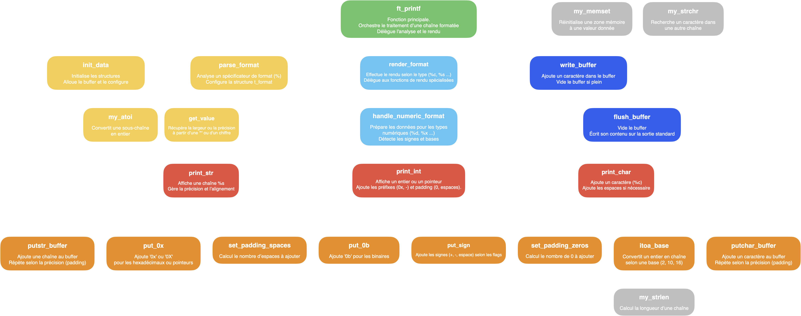

<p align="left">
  <a href="#--------ft_printf--">🇬🇧 English</a> |
  <a href="#--------ft_printf---1">🇫🇷 Français</a>
</p>

<h1 align="center">
  <br>
  
  <br>
  ft_printf
  <br>
</h1>

<h4 align="center"><em>Reimplementation of the C standard function printf().</em></h4>

<p align="center">
  
  
  
</p>

<p align="center">
  <a href="https://drive.google.com/file/d/1n9OCfkJZFZ6To6uJfclzwDJ21wtkuU_l/view?usp=sharing">Subject</a> |
  <a href="#-features">Features</a> •
  <a href="#-description">Description</a> •
  <a href="#%EF%B8%8F-compilation">Compilation</a>
</p>

---

## 📌 Features

### ✅ Mandatory part
- Reimplement the `printf` function from C standard library.
- Support the following conversions: `%c`, `%s`, `%p`, `%d`, `%i`, `%u`, `%x`, `%X`, `%%`.
- The function should output formatted data just like `printf`.

### 🚀 Bonus part
- Handle flags `# +` and field width specifications for all conversions.
- Manage combinations of `-0.` and other formatting elements.

---

## 📝 Description

Before diving into the function breakdown, it's important to understand how `printf` processes a format string.

The format follows this structure:

`%[flags][width][.precision]specifier`

Each part has a specific role:

- **Flags** (`- + # 0 space`): Modify output formatting (e.g., left-justify, force sign display, add prefixes).
- **Width** (`number` or `*`): Defines the minimum field width, either set manually or dynamically via an argument.
- **Precision** (`.number` or `.*`): Specifies decimal precision for floating-point numbers or the maximum number of characters for strings.
- **Specifier** (`cspdiuxX%`): Determines the type of data to format.

The diagram below illustrates how `ft_printf` parses and processes these format specifiers to produce correctly formatted output.


### 🔹 **`ft_printf`**
- **Role**: Main function that orchestrates the formatting and output of data.
- **Process**:
  - Initializes data structures.
  - Parses the format string and identifies specifiers.
  - Calls the corresponding rendering functions.
  - Manages the output buffer for performance.

### 🔹 **Parsing system**
- **`parse_format`**: Extracts format specifiers and flags.
- **`my_atoi`**: Converts numeric values (width, precision) from the format string.
- **`get_value`**: Processes variable width/precision values using `*`.

### 🔹 **Rendering functions**
- **`print_char`**: Handles character output (`%c`).
- **`print_str`**: Handles string output (`%s`).
- **`print_int`**: Handles integer output (`%d`, `%i`, `%u`).
- **`itoa_base`**: Converts numbers to strings in various bases (decimal, hexadecimal).

### 🔹 **Buffer system**
- **`write_buffer`**: Adds characters to an internal buffer before flushing.
- **`flush_buffer`**: Outputs stored characters efficiently.

---

## ⚙️ Compilation

### 🔧 Compilation
- **Mandatory part**:
  ```bash
  make
- **Bonus part**:
  ```bash
  make bonus

---

<h1 align="center">
  <br>
  
  <br>
  ft_printf
  <br>
</h1>

<h4 align="center"><em>Réimplémentation de la fonction printf() de la bibliothèque standard C.</em></h4>

<p align="center">
  
  
  
</p>

<p align="center">
  <a href="https://drive.google.com/file/d/1n9OCfkJZFZ6To6uJfclzwDJ21wtkuU_l/view?usp=sharing">Sujet</a> |
  <a href="#-fonctionnalit%C3%A9s">Fonctionnalités</a> •
  <a href="#-description-1">Description</a> •
  <a href="#%EF%B8%8F-compilation-1">Compilation</a>
</p>

---

## 📌 **Fonctionnalités**

### ✅ Partie obligatoire
- Réimplémentation de la fonction `printf` de la bibliothèque standard.
- Prise en charge des conversions suivantes : `%c`, `%s`, `%p`, `%d`, `%i`, `%u`, `%x`, `%X`, `%%`.
- La fonction doit produire une sortie formatée identique à `printf`.

### 🚀 Partie Bonus
- Gestion des flags `# +` et des spécifications de largeur.
- Prise en charge des combinaisons `-0.` et autres options de mise en forme.

---

## 📝 **Description**

Avant d'examiner le fonctionnement des fonctions, il est essentiel de comprendre comment `printf` interprète une chaîne de format.

La structure générale est la suivante :

`%[flags][width][.precision]specifier`
  
Chaque élément joue un rôle précis :

- **Flags** (`- + # 0 espace`) : Modifient le formatage de sortie (ex: alignement à gauche, affichage forcé du signe, ajout de préfixes).
- **Width** (`nombre` ou `*`) : Définit la largeur minimale du champ, soit fixée manuellement, soit déterminée dynamiquement via un argument.
- **Precision** (`.nombre` ou `.*`) : Spécifie la précision pour les nombres à virgule flottante ou le nombre maximal de caractères à afficher pour les chaînes.
- **Specifier** (`cspdiuxX%`) : Indique le type de données à formater.

Le diagramme ci-dessous illustre comment `ft_printf` analyse et traite ces spécificateurs de format afin de produire une sortie correctement mise en forme.



### 🔹 **`ft_printf`**
- **Rôle** : Fonction principale qui orchestre la mise en forme et l'affichage des données.
- **Fonctionnement** :
  - Initialise les structures de données.
  - Analyse la chaîne de format et identifie les spécificateurs.
  - Appelle les fonctions de rendu appropriées.
  - Gère un buffer de sortie pour améliorer les performances.

### 🔹 **Système de parsing**
- **`parse_format`** : Analyse les spécificateurs de format et les flags.
- **`my_atoi`** : Convertit les valeurs numériques (largeur, précision).
- **`get_value`** : Gère les valeurs de largeur/précision variables avec `*`.

### 🔹 **Fonctions d'affichage**
- **`print_char`** : Gère l'affichage des caractères (`%c`).
- **`print_str`** : Gère l'affichage des chaînes (`%s`).
- **`print_int`** : Gère l'affichage des entiers (`%d`, `%i`, `%u`).
- **`itoa_base`** : Convertit les nombres en chaînes selon leur base (décimal, hexadécimal).

### 🔹 **Système de buffer**
- **`write_buffer`** : Ajoute des caractères dans un buffer avant vidage.
- **`flush_buffer`** : Écrit efficacement le contenu du buffer.

---

## ⚙️ **Compilation**

### 🔧 Compilation
- **Partie obligatoire** :
  ```bash
  make
- **Partie bonus** :
  ```bash
  make bonus
